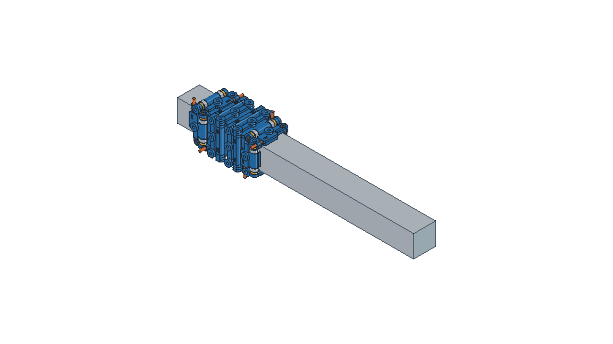

# 16Motion — adaptation pour profilé aluminium 3030

Ce dépôt est un fork du projet [mosomate/16motion](https://github.com/mosomate/16motion). Il ajoute une [adaptation mesurée pour un profilé 3030 de 29,83 × 29,95 mm](3030/README.md), avec les modèles FreeCAD, les STL prêts à imprimer, les vues d'assemblage et une animation du coulissement.

Version prête à imprimer : [3030Pro Sliding Carriage sur MakerWorld](https://makerworld.com/fr/models/3376063-3030pro-sliding-carriage#profileId-3840481).

> Cette variante correspond au profilé mesuré pour ce prototype. Tous les profilés appelés « 3030 » n'ont pas nécessairement la même section. Consultez les limites de validation avant impression.

## Qu'est-ce qu'un chariot 16Motion ?

16Motion est un chariot configurable et imprimable en 3D pour les petits profilés aluminium jusqu'à 40 mm de largeur. Un chariot se compose de quatre plaques imprimées, assemblées autour du profilé, et de composants faciles à trouver : roulements 684 (4 × 9 × 4 mm), vis M3 et M4 et écrous M3.

Chaque plaque possède huit points de fixation permettant de monter des outils et accessoires avec des vis et écrous M3. Ils sont répartis en deux groupes : quatre **points de fixation de plaque** indiqués par les flèches jaunes et quatre **points de fixation du chariot** indiqués par les flèches violettes.

Les points de fixation du chariot traversent au moins deux plaques et augmentent donc la rigidité de l'ensemble. Si seuls les points de fixation de plaque sont utilisés, l'auteur recommande d'ajouter également des vis M3 × 16 dans quelques points de fixation du chariot.

La distance horizontale entre les points est fixée à 23 mm. La distance verticale se calcule ainsi :

`distance verticale = (largeur du profilé + 9 mm) / 2`

## Adaptation 3030 de ce fork

La section du profilé utilisé pour cette adaptation a été mesurée à **29,83 mm sur l'axe X** et **29,95 mm sur l'axe Y**. Ces deux valeurs restent séparées dans les modèles : aucune moyenne ni mise à l'échelle globale des STL n'a été appliquée.

Pour construire un chariot complet :

- imprimer **2 plaques X** depuis `Plaque_X_2983.stl` ;
- imprimer **2 plaques Y** depuis `Plaque_Y_2995.stl` ;
- imprimer **16 entretoises** depuis `Entretoise.stl`.

Les modèles, les STL, la nomenclature et les contrôles réalisés se trouvent dans le [dossier 3030](3030/README.md).

## Avertissement

**L'auteur original précise qu'il n'est pas ingénieur mécanicien et que cette conception n'a pas fait l'objet d'essais professionnels. L'impression, l'assemblage et l'utilisation se font sous la responsabilité de l'utilisateur.**

Les roulements en acier roulent directement sur l'aluminium. Ils peuvent marquer ou user le profilé avec le temps. Pour une utilisation occasionnelle, l'effet peut rester limité. Pour une utilisation régulière, l'auteur conseille une légère lubrification, par exemple une fine couche de graisse au lithium.

Les vérifications CAO de cette variante ne constituent pas une validation de la capacité de charge, de l'usure ou du comportement mécanique réel. Un premier montage imprimé doit confirmer le coulissement, la précharge et l'absence de point dur sur toute la course.

## Nomenclature pour une plaque

Pour chacune des quatre plaques :

- 1 plaque imprimée en 3D ;
- 4 entretoises de roulement imprimées en 3D ;
- 2 vis M4 de longueur `largeur nominale du profilé + 10 mm` ;
- 2 vis M3 × 16 mm ;
- 2 écrous M3 autofreinés ;
- 4 roulements 684 (4 × 9 × 4 mm).

Pour la variante 3030 de ce dépôt, les axes de roulement sont des **vis M4 × 40 mm**.

## Conseils d'impression 3D

L'auteur fournit également des STL pour les profilés de **20 mm**, **25 mm** et **40 mm** sur [Thingiverse](https://www.thingiverse.com/thing:6853255). Pour une autre section, utilisez le modèle paramétrique FreeCAD.

Conseils de l'auteur :

- matériau recommandé : **PETG** ;
- supports limités aux zones en contact avec le plateau ;
- épaisseur de paroi de 1 mm ;
- épaisseur supérieure et inférieure de 0,5 mm.

Les STL de la variante 3030 sont exportés en millimètres, à l'échelle 100 %, avec une déviation de surface de **0,1 mm** et une déviation angulaire de **5°**.

## Personnalisation dans FreeCAD

1. Ouvrir `Plate.FCStd` dans FreeCAD.
2. Si seule l'entretoise apparaît, afficher l'objet **Plate**. Dans ses propriétés d'apparence, sélectionner à nouveau le mode **Flat Lines**.
3. Activer temporairement **Skip recomputes** sur le document pendant la modification.
4. Dans **Spreadsheet**, modifier :
   - **Ideal extrusion width** : largeur nominale d'un côté du profilé ;
   - **Actual extrusion width** : largeur réellement mesurée.
5. Recalculer **Spreadsheet**, puis les objets dépendants **Plate**, **Spacer** et **Assets**.
6. Dans l'atelier **Mesh**, créer un maillage de **Plate** avec une déviation de surface de 0,1 mm et une déviation angulaire de 5°.
7. Créer également le maillage de **Spacer**, puis exporter les deux maillages.

Pour un profilé dont les deux dimensions mesurées diffèrent, produire deux variantes distinctes comme dans le [dossier 3030](3030/README.md). Ne pas utiliser une moyenne arbitraire.

## Préparation d'une plaque

1. Après impression, tarauder en M4 les trous fixes **inférieur gauche** et **supérieur droit**.
2. Insérer un écrou M3 autofreiné dans le logement situé sous un levier de précharge.
3. Introduire une vis M3 × 16 à travers le levier et la visser jusqu'à ce qu'elle touche à peine le levier.
4. Répéter l'opération pour l'autre levier.

## Assemblage du chariot

Pour le chariot complet, prévoir 16 entretoises imprimées, 16 roulements 684 et 8 vis M4 de la longueur indiquée dans la nomenclature.

1. Emboîter les quatre plaques. De longues vis M3 ou des clés Allen placées temporairement dans les points de fixation du chariot facilitent l'alignement.
2. Visser une vis M4 dans le trou taraudé d'une plaque jusqu'à ce qu'elle atteigne l'autre côté.
3. Placer une entretoise et un roulement sur le trajet de la vis M4.
4. Avancer la vis jusqu'à maintenir ce premier ensemble.
5. Ajouter une seconde entretoise et un second roulement, puis visser complètement l'axe.
6. Serrer la vis M4 sans écraser le plastique.
7. Répéter l'opération aux sept autres positions.
8. Retirer les vis ou clés utilisées temporairement pour maintenir l'alignement.

## Réglage de la précharge

La règle de l'auteur est simple : **aucun jeu, mais pas de tension excessive**. Régler les deux leviers d'une même paire avec une précharge aussi équilibrée que possible.

1. Ébavurer légèrement les arêtes d'une extrémité du profilé.
2. Engager le chariot sur le profilé.
3. Serrer les vis d'une paire de leviers par petits incréments.
4. Faire coulisser le chariot après chaque ajustement.
5. Arrêter dès qu'une légère résistance apparaît à l'engagement.
6. Répéter pour les autres paires de leviers.

Le chariot doit encore descendre sous son propre poids lorsque le profilé est placé verticalement. S'il reste bloqué, la précharge est trop importante. Il est normal que certains roulements ne tournent pas en permanence pendant le déplacement.

## Licence et attribution

Conception originale : [mosomate/16motion](https://github.com/mosomate/16motion).

Ce travail est distribué sous licence [Creative Commons Attribution — Pas d'utilisation commerciale 4.0 International][cc-by-nc]. Cette adaptation conserve la même licence et n'accorde aucun droit supplémentaire.

[![CC BY-NC 4.0][cc-by-nc-image]][cc-by-nc]

[cc-by-nc]: https://creativecommons.org/licenses/by-nc/4.0/
[cc-by-nc-image]: https://licensebuttons.net/l/by-nc/4.0/88x31.png
